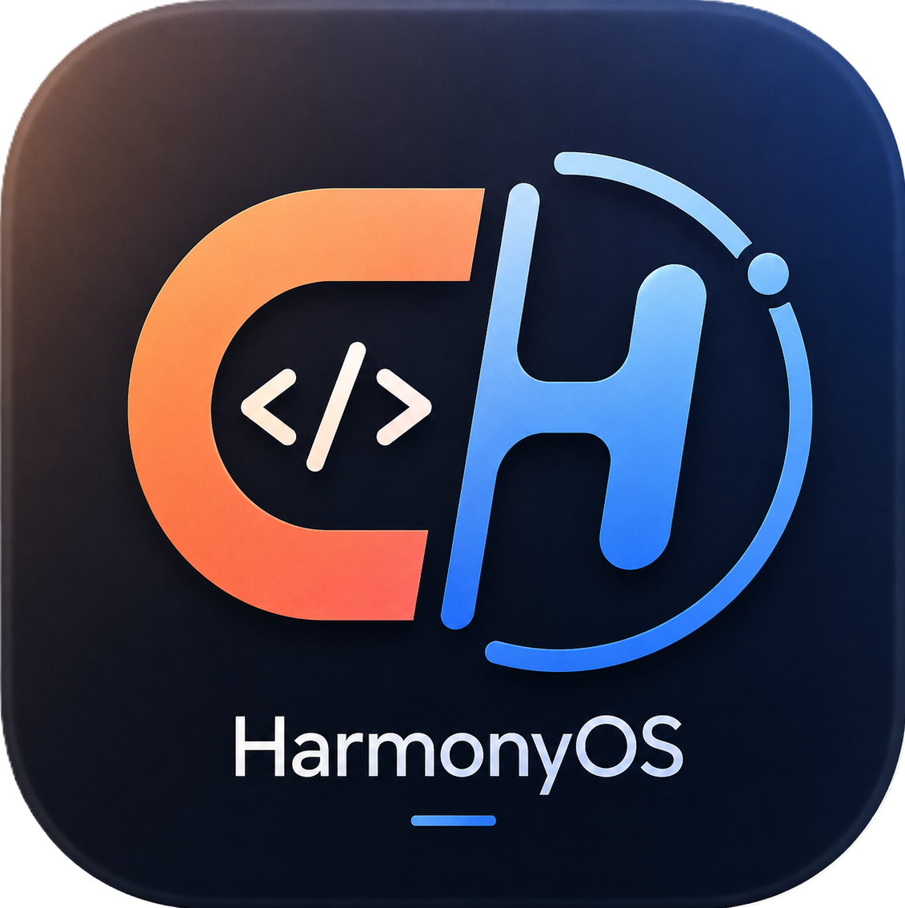

<div align="center">
  
</div>

<h1 align="center">CC-Remoter</h1>

<h4 align="center">在鸿蒙手机上远程操控你服务器上的 Claude Code</h4>

<div align="center">

[📦 **下载安装包**](https://github.com/2013358072/ClaudeHarmonyRemoter/releases) • [📖 **线协议文档**](docs/protocol.md) • [🔨 **构建与签名**](docs/build-and-sign.md)

</div>

---

## 它是怎么工作的？

在你的工作服务器上跑一个 Node.js 服务，它开一个端口并打印配对码。手机上的 App 扫码或手输配对码完成配对，之后就能选项目、选会话、发指令、看流式回复。

真正干活的 `claude` 进程是服务端在你发消息时拉起来的——**认证完全沿用你本机 `claude` 的配置**，所以你配的第三方中转（`ANTHROPIC_BASE_URL` + `ANTHROPIC_AUTH_TOKEN`）原样生效，不需要官方 API key。

```
┌─────────────┐      HTTP + WebSocket       ┌──────────────────┐
│  鸿蒙 App    │ ◄─────────────────────────► │  Node.js 服务端   │
│  (ArkTS)    │    配对码换 token 后长连接     │  驱动本机 claude  │
└─────────────┘                              └──────────────────┘
                                                      │
                                              Claude Agent SDK
                                                      ▼
                                              本机 claude 二进制
```

## 🔥 为什么做这个？

- 📱 **鸿蒙生态的空缺** —— 现有的 Claude Code 移动端方案都没有鸿蒙客户端
- 🔌 **中转友好** —— 不依赖官方登录，第三方中转开箱即用
- 🔄 **会话续接** —— 手机上能接着电脑上的对话继续问，反之亦然
- 🔍 **全量可见** —— 文本、思考过程、工具调用（含参数摘要和执行状态）、耗时与花费，逐条展示
- 🛠️ **开源自建** —— 没有中心服务器，没有遥测，数据只在你的设备和你的服务器之间流动

## 🚀 三步跑起来

**1. 服务器上启动服务**

```bash
cd server
npm install
npm start
```

终端会打印访问地址、6 位配对码和二维码。

**2. 手机上安装 App**

从 [Releases](https://github.com/2013358072/ClaudeHarmonyRemoter/releases) 下载，或 clone 仓库后用 DevEco Studio 自己签名安装（推荐，见下文）。

**3. 配对并开始**

App 里填服务器地址和配对码。凭据存在本地，之后启动直接进项目列表。

## 📦 项目组成

| 模块 | 说明 |
|---|---|
| **[服务端](server/)** | Node.js。扫描本机 Claude 会话、驱动 `claude` 进程、把消息流归一化后推给客户端 |
| **[鸿蒙客户端](entry/)** | ArkTS / ArkUI，API 24（HarmonyOS 6.1.1）。配对、项目列表、会话列表、聊天页 |
| **[线协议](docs/protocol.md)** | 两端共享的数据结构定义，以及实现过程中踩过的坑 |
| **[图标生成](scripts/make_icons.py)** | 从源 logo 生成鸿蒙分层图标 |

## 🔐 关于安全，说实话

这个项目**没有**端到端加密。通信走的是局域网内的明文 HTTP / WebSocket，靠 Bearer token 鉴权。请不要把端口直接暴露到公网——需要外网访问请走 tailscale、frp 之类的私有通道。

更要紧的是：首版 `permissionMode` 默认 `bypassPermissions`，因为客户端还没做权限交互界面。这意味着**手机发出的指令会在服务器上无确认地执行文件修改和 shell 命令**。

务必配置项目白名单把可访问范围锁死：

```json
// ~/.claude-harmony/config.json
{
  "projectRoots": ["/home/me/work"]
}
```

不配的话，你机器上所有 Claude 会话都会暴露给已配对的设备。服务端启动时会就此打印警告。

配对码一次性、5 分钟有效、连错 5 次锁 60 秒；token 以 `0600` 权限存在 `~/.claude-harmony/tokens.json`，它等价于服务器的远程执行权限。

## 🙏 致谢

本项目的架构设计大量参考了 **[slopus/happy](https://github.com/slopus/happy)**（MIT）—— Claude Code 与 Codex 的移动端/Web 客户端。

在动手之前，我们把它的 `happy-cli` 读了个透。几个关键认知直接来自它，没有这些参考会走很多弯路：

- **驱动方式的选择**。原本打算走「监控会话文件 + 模拟按键注入」的路子。是 Happy 的 `claudeRemote.ts` 证明了 `@anthropic-ai/claude-agent-sdk` 才是正解——它不是 Anthropic API 客户端，而是把 Claude Code 打包成库，因此中转配置原样生效。这一条推翻了我们最初的整个技术方案。
- **`CLAUDE_CODE_ENTRYPOINT` 陷阱**。Agent SDK 默认把该变量设为 `sdk-ts`，而 `claude --resume` 的选择器会隐藏这类会话。Happy 在 [slopus/happy#1202](https://github.com/slopus/happy/issues/1202) 里踩过并留下了注释，我们才没重蹈覆辙。
- **会话文件的识别规则**。`--resume` 只接受 UUID 格式、`agent-*` 子会话必须过滤——这些都来自 `claudeFindLastSession.ts`。
- **流式输入的形态**。用一个可外部推送的异步迭代器喂给 `query()`，让会话长驻，出自 `PushableAsyncIterable`。本项目的实现是重写的，但思路来自这里。

感谢 Happy 团队把这些踩坑经验开源出来。如果你用 iOS、Android 或 Web，**请直接去用 Happy**——它成熟得多，功能也完整得多（端到端加密、推送通知、语音、桌面端）。本项目只是补上鸿蒙这一块空缺。

## 📋 当前进度

已完成并实测通过：

- [x] 配对、token 签发与持久化、跨重启有效
- [x] 项目 / 会话扫描与列表接口
- [x] 历史消息解析与归一化
- [x] WebSocket 鉴权、attach、实时对话、打断
- [x] 会话续接
- [x] 鸿蒙端全部页面，可编译并签名出 HAP

尚未完成：

- [ ] 权限交互（手机弹窗批准工具调用）—— 协议已预留位置
- [ ] 扫码配对（目前手输地址和配对码，服务端已打印二维码）
- [ ] 鸿蒙端真机联调
- [ ] 推送通知

## 📚 文档

- [线协议](docs/protocol.md) —— 数据结构定义与实现踩坑记录
- [构建与签名](docs/build-and-sign.md) —— 鸿蒙签名步骤、命令行构建、服务端 systemd 部署

## 📄 License

MIT License —— 详见 [LICENSE](LICENSE)。
